#Build a Smart Video Interaction Filter

**Problem**: VLMs (GPT-4V, Claude) cost $0.01-0.05 per call. Running them on every video frame is too expensive.

**Solution**: Use cheap CV models to filter, only sending "interesting" frames to VLM.


## Architecture

```mermaid
flowchart TD
    A[Input Video] -->|Frame| B(Pose Detector<br/>YOLOv8)
    B -->|Keypoints| C{Overlap Check}
    C -- No --> D[Skip]
    C -- Yes --> E{Z-Plane Filter}
    
    E -->|Method: Heuristic| E1[Head Size/IPD Ratio]
    E -->|Method: MDE| E2[Depth Map Comparison]
    
    E1 --> F{Interaction?}
    E2 --> F
    
    F -- No --> D
    F -- Yes --> G{Temporal Filter<br/>> 2 Seconds}
    
    G -- Yes --> H[🔥 Trigger VLM]
    G -- No --> I[Buffer Interaction]
    I --> D
```



The project follows a modular architecture:
- **`core/`**: Contains `InteractionFilter` (logic) and `Comparator` (metrics).
- **`detectors/`**: Wrappers for `PoseDetector` (YOLO) and `DepthEstimator` (DepthAnything).
- **`utils/`**: Helper functions.
- **`config.py`**: Configuration and hardware selection.

### Core Logic Flow

1.  **Detection**: Detect humans with **YOLOv8-pose**.
2.  **Overlap Check**: Identify bounding box overlaps.
3.  **Z-Plane Filter**: Verify if subjects are on the same depth plane.
    - **Method 1: Heuristic (Default)**: Uses Head Size Ratio or IPD (Inter-pupillary distance) to estimate depth similarity. Fast but less accurate for back-views.
    - **Method 2: Monocular Depth Estimation (MDE)**: Uses **DepthAnything V2** to generate pixel-wise depth maps. Accurately handles occlusions and any pose.
4.  **Temporal Filter**: Triggers VLM only after **2 seconds** of consistent valid interaction.

## Installation & Usage (uv)

This project uses [uv](https://github.com/astral-sh/uv) for fast dependency management.

### 1. Install Dependencies
```bash
# Install uv if you haven't
curl -LsSf https://astral.sh/uv/install.sh | sh

# Initialize and sync
uv sync
```

### 2. Download Models
- **YOLO**: Auto-downloaded on first run.
- **DepthAnything**: You need `depth_anything_v2_vits.pth` (Small) for the MDE mode.
  - Download from: [Facebook Research / Hugging Face](https://huggingface.co/depth-anything/Depth-Anything-V2-Small/resolve/main/depth_anything_v2_vits.pth)
  - Place it in the root directory.

### 3. Run
**Heuristic Mode (Fastest)**
```bash
uv run main.py --video input.mp4 --method hybrid
```

**MDE Mode (Most Accurate)**
```bash
uv run main.py --video input.mp4 --method mde
```

**Output**
- Generates an annotated video (default: `output.mp4`).
- Prints a **Comparator Report** showing VLM triggers and cost reduction stats.

## Configuration
- Device (MPS/CUDA/CPU) is auto-detected. Override with `--device cpu`.
- Adjust thresholds in `config.py` (e.g., `INTERACTION_DURATION_SEC`).


