# Build a Smart Video Interaction Filter

**Problem**: VLMs (GPT-4V, Claude) cost $0.01-0.05 per call. Running them on every video frame is too expensive.

**Solution**: Use cheap CV models to filter, only sending "interesting" frames to VLM.


## Architecture

```mermaid
flowchart TD
    A[Input Video] -->|Frame| B(Pose Detector<br/>YOLOv8)
    B -->|Keypoints| C{Overlap Check}
    C -- No --> D[Skip]
    C -- Yes --> E{Z-Plane Filter}
    
    E -->|Method: Heuristic| E1[Head Size/IPD Ratio]
    E -->|Method: MDE| E2[Depth Map Comparison]
    
    E1 --> F{Interaction?}
    E2 --> F
    
    F -- No --> D
    F -- Yes --> G{Temporal Filter<br/>> 2 Seconds}
    
    G -- Yes --> H[🔥 Trigger VLM]
    G -- No --> I[Buffer Interaction]
    I --> D
```



The project follows a modular architecture:
- **`core/`**: Contains `InteractionFilter` (logic) and `Comparator` (metrics).
- **`detectors/`**: Wrappers for `PoseDetector` (YOLO) and `DepthEstimator` (DepthAnything).
- **`utils/`**: Helper functions.
- **`config.py`**: Configuration and hardware selection.

### Core Logic Flow

1.  **Detection**: Detect humans with **YOLOv8-pose**.
2.  **Overlap Check**: Identify bounding box overlaps.
3.  **Z-Plane Filter**: Verify if subjects are on the same depth plane.
    - **Method 1: Heuristic (Default)**: Uses Head Size Ratio or IPD (Inter-pupillary distance) to estimate depth similarity. Fast but less accurate for back-views.
    - **Method 2: [Monocular Depth Estimation (MDE)**](https://github.com/DepthAnything/Depth-Anything-V2): Uses **DepthAnything V2** to generate pixel-wise depth maps. Accurately handles occlusions and any pose.
4.  **Temporal Filter**: Triggers VLM only after **2 seconds** of consistent valid interaction.

## Installation & Usage (uv)

This project uses [uv](https://github.com/astral-sh/uv) for fast dependency management.

### 1. Install Dependencies
```bash
# Install uv if you haven't
curl -LsSf https://astral.sh/uv/install.sh | sh

# Initialize and sync
uv sync
```

### 2. Download Models
- **YOLO**: Auto-downloaded on first run.
- **DepthAnything**: You need `depth_anything_v2_vits.pth` (Small) for the MDE mode.
  - Download from: [Facebook Research / Hugging Face](https://huggingface.co/depth-anything/Depth-Anything-V2-Small/resolve/main/depth_anything_v2_vits.pth)
  - Place it in the root directory.

### 3. Run
**Heuristic Mode (Fastest)**
Best for real-time applications where minor depth inaccuracies are acceptable.
```bash
uv run main.py --video input.mp4 --output output_hybrid.mp4 --method hybrid
```

**MDE Mode (Most Accurate)**
Uses DepthAnything V2 for robust depth verification. Slower but handles occlusions better.
*Note: Ensure `depth_anything_v2_vits.pth` is in the root folder.*
```bash
uv run main.py --video input.mp4 --output output_mde.mp4 --method mde
```

**Common Arguments**
- `--video`: Path to input video (default: `input.mp4`)
- `--output`: Path to output annotated video (default: `output.mp4`)
- `--method`: Interaction detection method: `hybrid`, `mde`, `head`, or `ipd` (default: `hybrid`)
- `--device`: Force device usage: `mps`, `cuda`, or `cpu` (default: auto-detect)

**Output**
- Generates an annotated video with visual debug cues.
- Prints a **Comparator Report** showing VLM triggers and cost reduction stats.

### 4. Visual Output Explained
The output video contains debugging markings to help verify the Z-Plane logic:
- **Green Lines**: Connects two people who are overlapping in 2D **AND** are determined to be on the same depth plane.
- **Group Coloring**: People in the same interaction group (overlapping + same depth) are highlighted with the same unique color.
- **Z-Values**: Displayed next to the ID (e.g., `ID: 0 Z: 0.45`). Comparable values indicate the same depth.
- **VLM Triggers**: The count displayed on the video (and in the final report) represents the number of **frames** that would trigger a VLM API call.

**Console Logs**
The application logs interacting groups with timestamps to standard output:
```text
[Frame 45 | 00:00:01.50] Interaction Group: [0, 1]
```


### 5. Testing
To run the test suite, run the following command:

```bash
PYTHONPATH=. uv run pytest
```

## Performance Benchmarks
Comparison of filtering methods on `input.mp4` (192 frames).

| Method | Execution Time | Processing Speed | Speedup | VLM Savings (1.0s Trigger) |
|--------|----------------|------------------|---------|-------------|
| **Hybrid Mode** | **~9 s** | **~22 fps** | **~5.0x** | **92%** |
| MDE Mode | ~43 s | ~4.5 fps | 1.0x | 99% |

### Threshold Sensitivity impact
Lowering the trigger threshold to **0.5s** reveals the robustness difference:
- **Hybrid Mode**: VLM triggers jumped to **53** (noisy detection).
- **MDE Mode**: VLM triggers remained at **1** (robust detection).

> **Conclusion**: MDE provides superior depth understanding and stability, while Hybrid mode requires a longer temporal buffer (1.0s+) to filter out noise effectively.

## VLM Context & Trade-offs

### The "Filtered View" Sacrifice
By design, this system selectively triggers the VLM only during high-probability interactions. This saves cost (~98%) but introduces a trade-off: **Loss of Temporal Context**.
- The VLM receives isolated frames (or short bursts) of the "action".
- It may miss the *context* leading up to the event (e.g., *why* two people started fighting, or where they came from).
- It lacks the continuous "story" of the video.

### How to Preserve Context
To mitigate this while maintaining cost savings, use a **Dual-Stream Strategy**:

1.  **Event Stream (High Res)**:
    - Use this filter to detecting "interesting" frames.
    - Send these frames to a **High-Intelligence VLM** (e.g., GPT-4o, Claude 3.5 Sonnet) for detailed analysis.
    - **Buffer Context**: When a trigger occurs, capture a small buffer window `[Trigger - 2s, Trigger + 2s]` to give the VLM immediate local context.

2.  **Context Stream (Low Res)**:
    - Parallel to the filter, sample the video at a very low FPS (e.g., 0.5 FPS) and low resolution.
    - Feed this stream to a **Low-Cost VLM** (e.g., Gemini Flash, GPT-4o-mini).
    - Maintain a running text summary (state) of the scene.
    - Include this summary in the prompt when the High-Intelligence VLM is triggered.

**Example Prompt with Context:**
> "Here is a high-res image of a potential fight.
> **Context**: *Previous summary: Two subjects walked in from the left and argued near the desk for 30 seconds.*
> Describe the current interaction in detail."

## Configuration
- Device (MPS/CUDA/CPU) is auto-detected. Override with `--device cpu`.
- Adjust thresholds in `config.py` (e.g., `INTERACTION_DURATION_SEC`).


